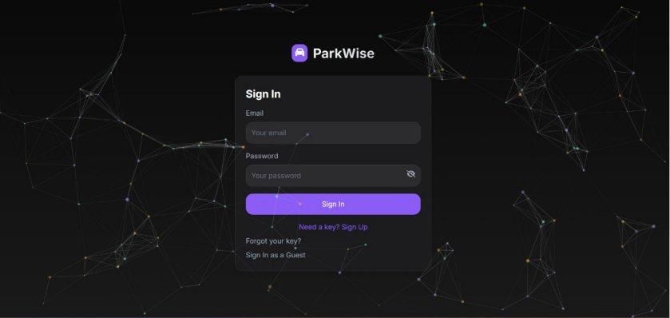
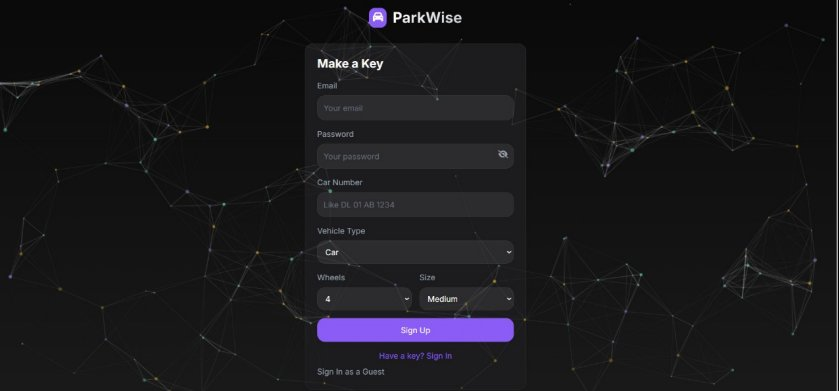
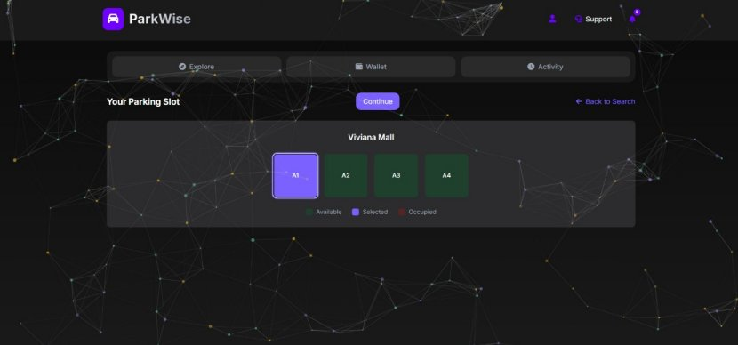
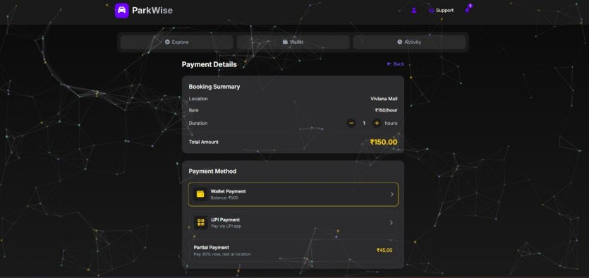
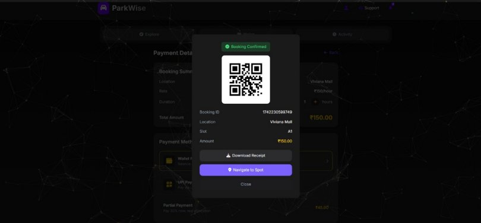
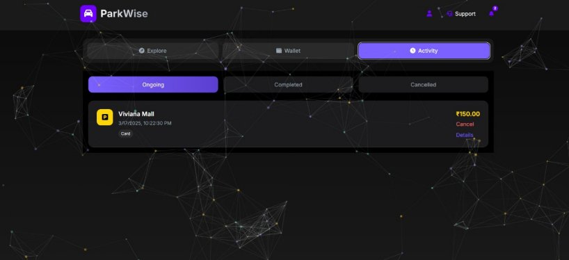
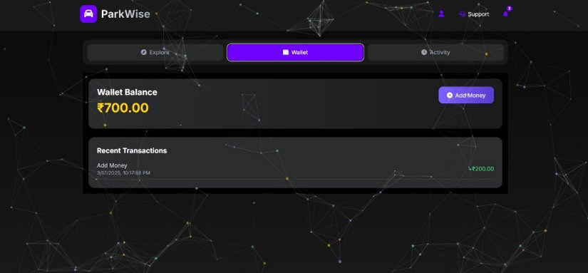
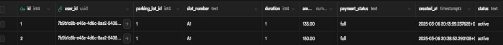
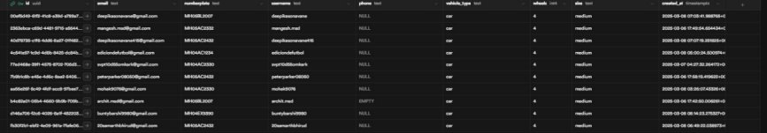

# 🅿️ ParkWise — IoT & AI Based Smart Parking System

> A full-stack smart parking management system integrating IoT hardware, AI-based vehicle validation, and a real-time web application to streamline urban parking.

     

---

## 📌 Table of Contents

- [About the Project](#about-the-project)
- [Problem Statement](#problem-statement)
- [Solution](#solution)
- [Features](#features)
- [Tech Stack](#tech-stack)
- [Hardware Components](#hardware-components)
- [System Architecture](#system-architecture)
- [Application Screenshots](#application-screenshots)
- [Database Schema](#database-schema)
- [Methodology](#methodology)
- [Future Scope](#future-scope)
- [Team](#team)

---

## 📖 About the Project

**ParkWise** is an IoT and AI-powered smart parking system designed for urban environments and institutions. It provides real-time parking slot availability, automated vehicle validation via number plate recognition, and a seamless web-based booking experience for drivers, administrators, and guest users.

The system combines a modern React frontend, a Node.js backend, Supabase database, MQTT IoT connectivity, and physical hardware components (IR sensors, ESP32-CAM, servo motors) to deliver an end-to-end smart parking solution.

---

## ❗ Problem Statement

- Existing parking systems rely heavily on **manual oversight**, causing inaccuracies in slot tracking and booking records.
- Tasks like monitoring spaces, processing reservations, and verifying vehicle entries are **labor-intensive** with no automation.
- Manual errors lead to **misallocation of parking slots**, causing confusion and delays.
- No advanced tools exist for **analyzing parking patterns** and trends, limiting proactive decision-making.

---

## ✅ Solution

- Deploy an **automated parking management system** for slot monitoring, booking, and vehicle verification.
- Establish a **centralized real-time database** accessible to authorized users showing live slot availability and booking status.
- Build an **intuitive web-based interface** for drivers, admins, and facility managers.
- Enforce **stringent security protocols** to protect sensitive parking data.

---

## ✨ Features

| Feature | Description |
|---|---|
| 🔐 User Authentication | Sign in / Sign up for registered users; guest booking without registration |
| 🗺️ Explore & Search | Google Maps integration showing nearby parking lots with live availability |
| 🟢 Real-Time Slot Map | Color-coded slot indicators — green (available), purple (selected), red (occupied) |
| 💳 Payment Options | Wallet, UPI, and partial payment (30% now, rest at location) |
| 📷 Number Plate Recognition | ESP32-CAM validates vehicles on arrival automatically |
| 🚦 Barrier Automation | Servo motor opens/closes gate based on booking confirmation |
| 📍 Navigation | Turn-by-turn Google Maps navigation to booked parking slot |
| 🧾 Booking History | Track ongoing, completed, and cancelled bookings |
| 👛 Wallet Management | Add funds, view transaction history |
| 📊 Admin Insights | Monitor occupancy, manage slots, generate usage reports |

---

## 🛠️ Tech Stack

| Layer | Technology |
|---|---|
| Frontend | React.js |
| Backend | Node.js + Express |
| Database | PostgreSQL via Supabase |
| IoT Protocol | MQTT |
| Navigation | Google Maps API |
| IDE | Visual Studio Code |

---

## 🔩 Hardware Components

| Component | Purpose |
|---|---|
| **Arduino UNO R3** | Primary microcontroller; interfaces with sensors and output devices |
| **ESP8266 Module** | Wi-Fi connectivity for IoT-to-server communication |
| **ESP32-CAM** | Number plate recognition for vehicle validation |
| **IR Sensors** | Detect vehicle presence/absence in each parking slot |
| **Servo Motor** | Controls barrier/gate for automated vehicle access |
| **PCB Board** | Stable mounting and interconnection of all hardware components |
| **7805 IC** | Voltage regulator — stable 5V output from 9V/12V supply |
| **Power Connector Barrel Jack** | Interfaces system with external DC power source |
| **FTDI Programmer** | Programs ESP8266 and microcontrollers via serial communication |
| **Jumper Wires** | Flexible connections between hardware components |

---

## 🏗️ System Architecture

```
┌─────────────────────────────────────────────────────┐
│                    USER INTERFACE                    │
│              React.js Web Application                │
│   Sign In | Explore | Book | Pay | Navigate | Track  │
└─────────────────────┬───────────────────────────────┘
                      │ REST API
┌─────────────────────▼───────────────────────────────┐
│                  BACKEND SERVER                      │
│             Node.js + Express APIs                   │
│    Auth | Booking | Payment | IoT Data Handler       │
└────────┬────────────────────────┬───────────────────┘
         │ Supabase / PostgreSQL  │ MQTT
┌────────▼──────────┐    ┌───────▼──────────────────┐
│     DATABASE      │    │      IoT HARDWARE         │
│  users | bookings │    │  IR Sensors → Slot Status │
│  slots | IoTSystem│    │  ESP32-CAM → Plate Detect │
└───────────────────┘    │  Servo Motor → Gate Ctrl  │
                         └──────────────────────────┘
```

---

## 📸 Application Screenshots

### 1. 🔐 Sign In Page
Entry point for registered users. Features a sleek dark theme with geometric network pattern. Supports guest login for users who don't want to register.



---

### 2. 📝 Sign Up Page
New users register with email, password, car number plate, vehicle type, wheels, and size. All data is stored in the `users` table and used later for IoT-based number plate validation.



---

### 3. 🟢 Slot Selection Page
Color-coded visual grid of parking slots at Viviana Mall:
- 🟣 **Purple** = Selected
- 🟢 **Green** = Available
- 🔴 **Red** = Occupied

Users pick a slot (e.g., A1) and click **"Continue"** to proceed to payment.



---

### 4. 💳 Payment Page
Review booking summary — Location: Viviana Mall, Rate: ₹150/hour, Duration: 1 hour, Total: ₹150.00. Choose from:
- 💰 **Wallet Payment** (Balance: ₹500)
- 📱 **UPI Payment** — Pay via UPI app
- 🔀 **Partial Payment** — 30% now (₹45.00), rest at location



---

### 5. ✅ Booking Confirmation Page
After payment the booking is confirmed with a QR code for parking entry. Shows Booking ID, Location (Viviana Mall), Slot (A1), and Amount (₹150.00). Options to **Download Receipt** or **Navigate to Spot**.



---

### 6. 📋 Activity Page
View all bookings across **Ongoing**, **Completed**, and **Cancelled** tabs. Shows active bookings (Viviana Mall, ₹150.00, 3/17/2025, 10:22:30 PM) with options to **Cancel** or view **Details**.



---

### 7. 👛 Wallet Page
Displays wallet balance (₹700.00) with an **Add Money** button. Recent transactions panel shows fund additions (e.g., +₹200.00 on 3/17/2025, 10:17:58 PM).



---

### 8. 🗄️ Database — Bookings Table (Live Data)
Live Supabase table showing active bookings with `user_id`, `parking_lot_id`, `slot_number`, `duration`, `amount`, `payment_status`, and `status` fields.



---

### 9. 🗄️ Database — Users Table (Live Data)
Live Supabase users table showing registered user records with `email`, `numberplate`, `username`, `vehicle_type`, `wheels`, `size`, and `created_at` fields.



---

## 🗄️ Database Schema

### Users Table
```sql
CREATE TABLE users (
  id UUID PRIMARY KEY REFERENCES auth.users(id) ON DELETE CASCADE,
  email TEXT NOT NULL UNIQUE,
  numberplate TEXT NOT NULL,
  username TEXT NOT NULL,
  phone TEXT,
  vehicle_type TEXT DEFAULT 'car',
  wheels INTEGER DEFAULT 4,
  size TEXT DEFAULT 'medium',
  created_at TIMESTAMP WITH TIME ZONE DEFAULT NOW()
);
```

### Bookings Table
```sql
CREATE TABLE bookings (
  id SERIAL PRIMARY KEY,
  user_id UUID REFERENCES users(id) ON DELETE SET NULL,
  parking_lot_id INTEGER,
  slot_number TEXT,
  duration INTEGER,
  amount DECIMAL(10, 2),
  payment_status TEXT DEFAULT 'pending',
  created_at TIMESTAMP WITH TIME ZONE DEFAULT NOW(),
  status TEXT DEFAULT 'active'
);
```

> `user_id` is nullable to support guest bookings without registration.

---

## 🔄 Methodology

The project followed a structured **5-phase development approach**:

1. **Phase 1 – Ideation & Conceptualization** — Defined objectives, scope, user types (registered, new, guest), and system architecture. Selected tech stack.
2. **Phase 2 – Hardware & Software Development** — UI built in React, RESTful APIs in Node.js, IoT circuit assembled, physical parking lot model constructed.
3. **Phase 3 – System Integration** — IoT connected to backend via MQTT. Web app synced with real-time database. Servo motor integrated for barrier automation.
4. **Phase 4 – Testing & Debugging** — Unit, integration, and user acceptance testing. Resolved sensor delays, payment errors, and UI bugs.
5. **Phase 5 – Documentation & Reporting** — Compiled full project report and Gantt chart.

---

## 🚀 Future Scope

- 📱 **Mobile App** with push notifications, voice commands, and wearable integration
- 🤖 **Predictive Analytics** using ML to forecast parking demand and enable dynamic pricing
- ⚡ **EV Charging Station Management** — reserve parking + charging spots simultaneously
- 🚗 **Autonomous Vehicle Support** — self-parking via direct platform communication
- 🏙️ **Smart City Integration** — share data with city planners for traffic and infrastructure decisions
- 🔐 **Enhanced Security** — advanced encryption, multi-factor authentication, open APIs for IoT interoperability

---

## 👥 Team

| Name | Role |
|---|---|
| **Omkar Kudav** | Team Member |
| **Aayush Chavanke** | Team Member |
| **Archit Deorukhkar** | Team Member |
| **Sandesh Mulik** | Team Member |

**Project Guide:** Mrs. Swati Joshi  
**Department:** Information Technology  
**Institution:** V.P.M's Polytechnic, Thane  
**Academic Year:** 2024–25

---

## 📚 References

**Books:**
- *Internet of Things: Principles and Paradigms* — Rajkumar Buyya & Amir Vahid Dastjerdi
- *The Internet of Things* — Samuel Greengard

**Links:**
- [Number Plate Recognition API for Embedded Boards](https://circuitdigest.com/article/number-plate-recognition-api-for-low-power-embedded-soc-boards)
- [IoT-Based Car Parking System using Arduino UNO](https://mytrained.com/2024/05/22/iot-based-car-parking-system-using-arduino-uno/)
- [AI-Based Smart Parking System](https://circuitdigest.com/projects/ai-based-smart-parking-system)
- [Problem of Parking in Urban Areas](https://countercurrents.org/2021/07/problem-of-parking-in-urban-areas-and-their-possible-solutions/)

---

<p align="center">Made with ❤️ by Team ParkWise | V.P.M's Polytechnic, Thane | 2024–25</p>
